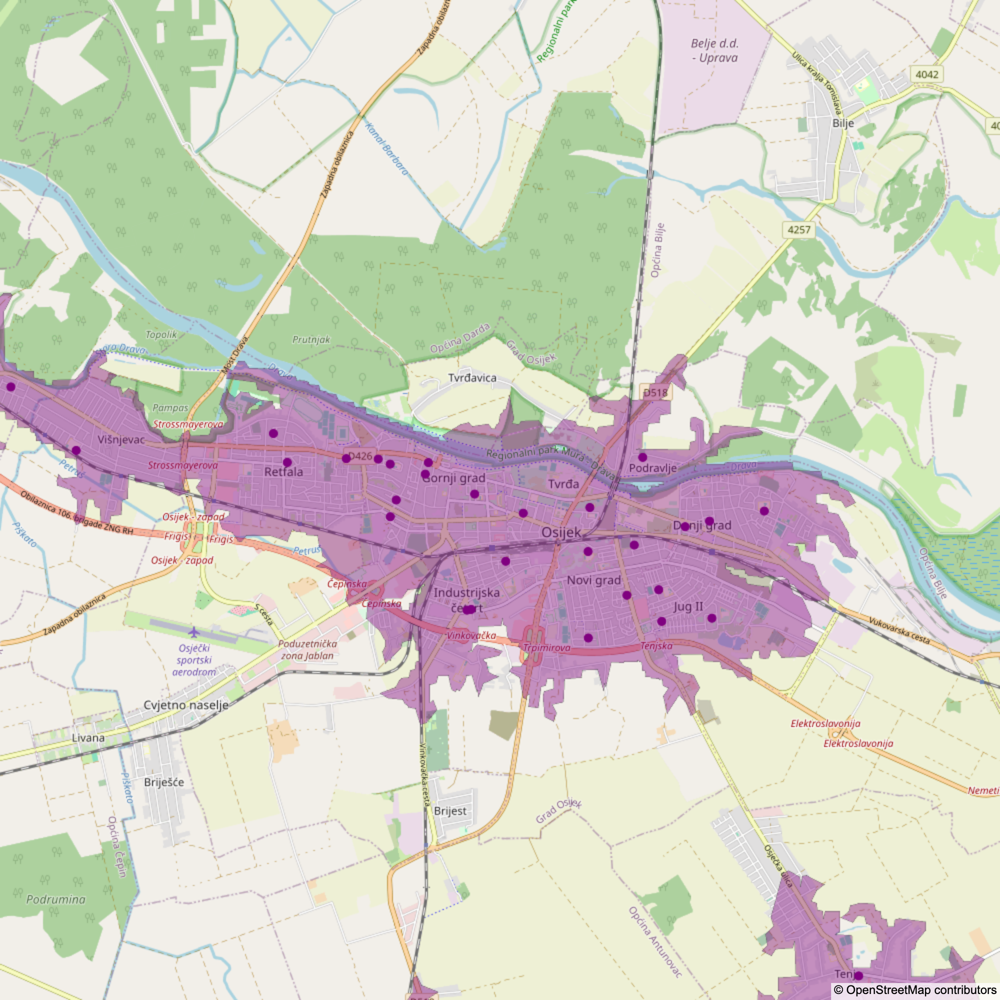
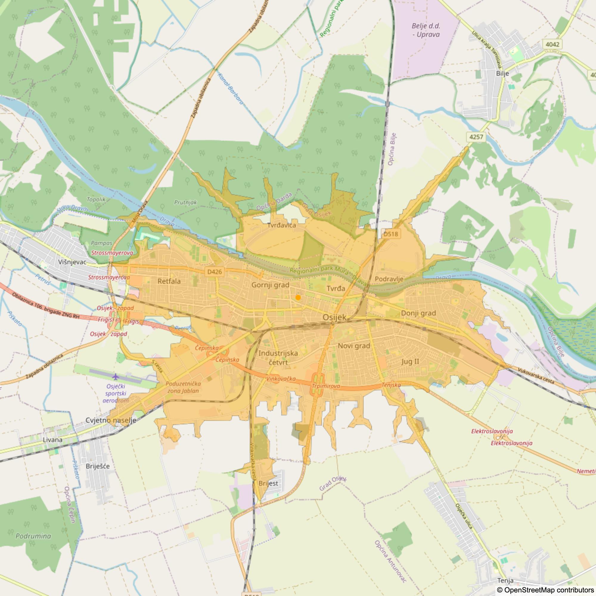

<!-- Improved compatibility of back to top link: See: https://github.com/othneildrew/Best-README-Template/pull/73 -->
<a name="readme-top"></a>
<!--
*** Thanks for checking out the Best-README-Template. If you have a suggestion
*** that would make this better, please fork the repo and create a pull request
*** or simply open an issue with the tag "enhancement".
*** Don't forget to give the project a star!
*** Thanks again! Now go create something AMAZING! :D
-->


<!-- PROJECT SHIELDS -->
<!--
*** I'm using markdown "reference style" links for readability.
*** Reference links are enclosed in brackets [ ] instead of parentheses ( ).
*** See the bottom of this document for the declaration of the reference variables
*** for contributors-url, forks-url, etc. This is an optional, concise syntax you may use.
*** https://www.markdownguide.org/basic-syntax/#reference-style-links
-->

<!-- [![Contributors][contributors-shield]][contributors-url]
[![Forks][forks-shield]][forks-url]
[![Stargazers][stars-shield]][stars-url]
[![Issues][issues-shield]][issues-url]
[![MIT License][license-shield]][license-url]
[![LinkedIn][linkedin-shield]][linkedin-url] -->


<!-- PROJECT LOGO -->
<br />
<div align="center">

  <h3 align="center">Maps</h3>

  <p align="center">
    Help yourself find location for living!
  </p>
</div>


<!-- TABLE OF CONTENTS -->

## Table of Contents
<ol>
<li>
    <a href="#about-the-project">About The Project</a>
</li>
<li><a href="#getting-started">Getting Started</a> </li>
<li><a href="#usage">Usage</a></li>
<li><a href="#adding-custom-constraints">Adding custom constraints</a></li>
<li><a href="#roadmap">Roadmap</a></li>
<li><a href="#contributing">Contributing</a></li>
<li><a href="#license">License</a></li>
<!-- <li><a href="#contact">Contact</a></li> -->
<li><a href="#acknowledgments">Acknowledgments</a></li>
</ol>


<!-- ABOUT THE PROJECT -->
## About The Project

<!-- [![Product Name Screen Shot][product-screenshot]](https://example.com) -->

Moving to new location can be a big stress. Finding ideal spot varies from one individual to another and can be conditioned by many factors (proximity of schools, kindergartens, public transportation, parks, ...). I have been moving in my life quite a lot and during this process, had developed my own "search engine" how to find good place for living.
Ideas that are behind this simple repository helped me already few times. Hope they will help someone else too. :-)
Data shared is based around city of Osijek but can be easily extend to any other location.

DISCLAIMER: Lcations were gathered from personal experience. It is possible that some locations are just missed, e.g., private kindergartens that are not well known.


<p align="right">(<a href="#readme-top">back to top</a>)</p>


<!-- GETTING STARTED -->
## Getting Started

Maps tool relies on standard python packages (plotly + Mapbox API, shapely, ...). In order to use the tool, please follow the installation instructions below.


1. Clone the repo
   ```sh
   git clone https://github.com/MesicBenjamin/Maps.git
   ```
2. Install requirements
   ```sh
   python -m venv venv
   source venv/bin/activate
   pip install -r Maps/requirements.txt
   pip install Maps/.
   cd Maps
   ```

3. In [data/tokens/mapbox.txt](data/tokens/mapbox.txt) replace 
   ```txt
   <Here comes Mapbox API token> 
   ```
    with your Mapbox API key. To get one, sign up at [https://www.mapbox.com](https://www.mapbox.com)

<p align="right">(<a href="#readme-top">back to top</a>)</p>


<!-- USAGE EXAMPLES -->
## Usage

Command below will generate several different categories of layers (kindergarten, schools, ...) that are defined in config all.json. 

   ```sh
    python main.py -p data/config/all.json  
   ```

Kindergartens are shown as purple points on the map. Highlighted region indicates teritory that is within 20 minutes walking distance from the nearest location.


Schools are shown as red points on the map. Highlighted region indicates teritory that is within 20 minutes walking distance from the nearest location.


Swimming pool is shown as blue point on the map. Highlighted region indicates teritory that is within 20 minutes cycling distance from the location.


School of applied mathematics (University of Osijek) is shown as blue point on the map. Highlighted region indicates teritory that is within 20 minutes cycling distance from the location.


Roads with dense traffic and railways are shown as gray regions. 


Location of power plants are shown as gray points on the map. Region around them is chosen arbitrarily.


Intersection of all maps is highlighted green. Resulting region satisifes all constraints.


Interactive mode
If one wants to study resulting map into greater detail, it is recommended to open [interactive.ipynb](interactive.ipynb) with jupyter notebook
   ```sh
    jupyter-notebook
   ```

<p align="right">(<a href="#readme-top">back to top</a>)</p>

## Adding custom constraints

Add new data should be done in two steps

1. In [data/database](data/database) add new location (with GPS coordinates) to existing categories or add new category following the formatting below
   ```json
    "Location Test ABC" : {
        "coordinates" : [
            {
                "lat": 45.56096871749088,
                "lon": 18.690122856208774
            }
        ]
    }
   ```
2. In [data/config](data/config) add custom config file following the formatting
   ```json
    {
        "locations": [         
            {
                "name": "Ulica Svetog Leopolda Bogdana Mandica",
                "category": "traffic",
                "type" : "line",
                "buffer_distance": 0.00025,
                "color": "black"
            },
        
            {
                "name": "Osnovna skola Frana Krste Frankopana",
                "category": "school",
                "type" : "isochrone",            
                "profile": "walking",
                "contours_minutes": 10,
                "color": "red"
            },

            {
                "name": "Djecji vrtic Visnjevac",
                "category": "kindergarten",
                "type" : "isochrone",            
                "profile": "walking",
                "contours_minutes": 20,
                "color": "purple"
            }
        ],
        "logic" : {
            "intersection" : ["kindergarten", "school"],
            "union" : [],
            "difference" : ["traffic"]
        }
    }
   ```
For the sake of simplicity, very few locations from the total list of possible locations is shown. Each location must be added by the name and category that was defined in [data/database](data/database). There are multiple types of location currently supported: line (set of coordinates with distance from it), isochrone suppored by Mapbox (single coordinate with profile type: walking, cycling, driving and minutes range: 10, 20, 30, ...), circle (single coordinate with radius), and standard (set of coordinates that defines region within).


<!-- ROADMAP -->
## Roadmap

- [x] Create initial functionalities
- [x] Share analysis
- [] Add more data 

<p align="right">(<a href="#readme-top">back to top</a>)</p>


<!-- CONTRIBUTING -->
## Contributing

Contributions are what make the open source community such an amazing place to learn, inspire, and create. Any contributions you make are **greatly appreciated**.

If you have a suggestion that would make this better, please fork the repo and create a pull request. You can also simply open an issue with the tag "enhancement".
Don't forget to give the project a star! Thanks again!

1. Fork the Project
2. Create your Feature Branch (`git checkout -b feature/AmazingFeature`)
3. Commit your Changes (`git commit -m 'Add some AmazingFeature'`)
4. Push to the Branch (`git push origin feature/AmazingFeature`)
5. Open a Pull Request

<p align="right">(<a href="#readme-top">back to top</a>)</p>


<!-- LICENSE -->
## License

Distributed under the MIT License. See `LICENSE.txt` for more information.

<p align="right">(<a href="#readme-top">back to top</a>)</p>


<!-- CONTACT
## Contact

Your Name - [@your_twitter](https://twitter.com/your_username) - email@example.com

Project Link: [https://github.com/MesicBenjamin/Maps](https://github.com/MesicBenjamin/Maps)

<p align="right">(<a href="#readme-top">back to top</a>)</p> -->


<!-- ACKNOWLEDGMENTS -->
## Acknowledgments


* Readme template: [https://github.com/othneildrew/Best-README-Template](https://github.com/othneildrew/Best-README-Template)
* Map functionalities: [Mapbox](https://www.mapbox.com)

<p align="right">(<a href="#readme-top">back to top</a>)</p>


<!-- MARKDOWN LINKS & IMAGES
https://www.markdownguide.org/basic-syntax/#reference-style-links
[product-screenshot]: images/screenshot.png -->
